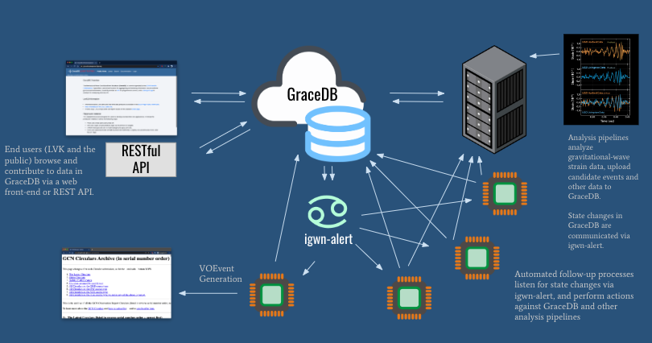

================
Introduction
================

GraceDB in context
==========================

GraceDB serves as a communications hub and as a database for storing and displaying
information about candidate gravitational-wave events and related electromagnetic events:

The primary responsibilities of GraceDB are to:

- ingest and store information about candidate events
- expose that information to users and followup robots
- send alerts about new information and state changes to users

As such, GraceDB curates content from many sources, but does not itself produce
any original scientific content.  The service is mainly geared toward low latency
data analysis
and electromagnetic followup, but need not be used exclusively for those
purposes. The diagram above depicts a typical sequence of events:

#. An LVK data analysis pipeline detects an interesting candidate
   gravitational wave (GW) event and submits it to GraceDB.
#. GraceDB sends an igwn-alert message which notifies LVK followup 
   robots of the new event.
#. The followup robots perform analyses and report results back to
   GraceDB. These results accumulate on the candidate event's page.
#. Eventually, a designated `EM approval robot <https://rtd.igwn.org/projects/gwcelery/en/latest/index.html>`__ 
   forwards the event to `GCN/TAN <http://gcn.gsfc.nasa.gov>`__.
#. Astronomers receive a GCN Notice for the new event, perform followup
   observations, and report coordinates via GraceDB.

Overview of components
======================
GraceDB consists of the server (e.g., `gracedb.ligo.org <https://gracedb.ligo.org>`__) 
and a set of client tools. Two user interfaces are available: the web interface
for browser access, and the 
`REST <https://en.wikipedia.org/wiki/Representational_state_transfer>`__ API.
These interfaces represent the information in GraceDB in different ways:
the web interface represents information as human-readable HTML pages, whereas
the REST interface delivers JSON-serialized data.

The `ligo-gracedb client package <https://ligo-gracedb.readthedocs.io/>`__ provides a convenient way to interact with the REST API.
This package includes a Python client class with methods for all common GraceDB operations.
There is also a ``gracedb`` executable for the command line with much of the same functionality.

The GraceDB API conforms to the RESTful principles of "uniform interface" and
"resource-oriented architecture".

Where can I go for help?
==================================
This documentation is not as great as it could be, but we are working on it.

LIGO/Virgo/KAGRA users can join the `GraceDB channel <https://chat.ligo.org/ligo/channels/gracedb>`__  in the collaboration's Mattermost instance or email the Compsoft mailing list for help.

To report a problem, either `post an issue <https://git.ligo.org/lscsoft/gracedb/issues>`__ or email the 
`IGWN Computing Helpdesk <mailto:computing-help@igwn.org>`__.
