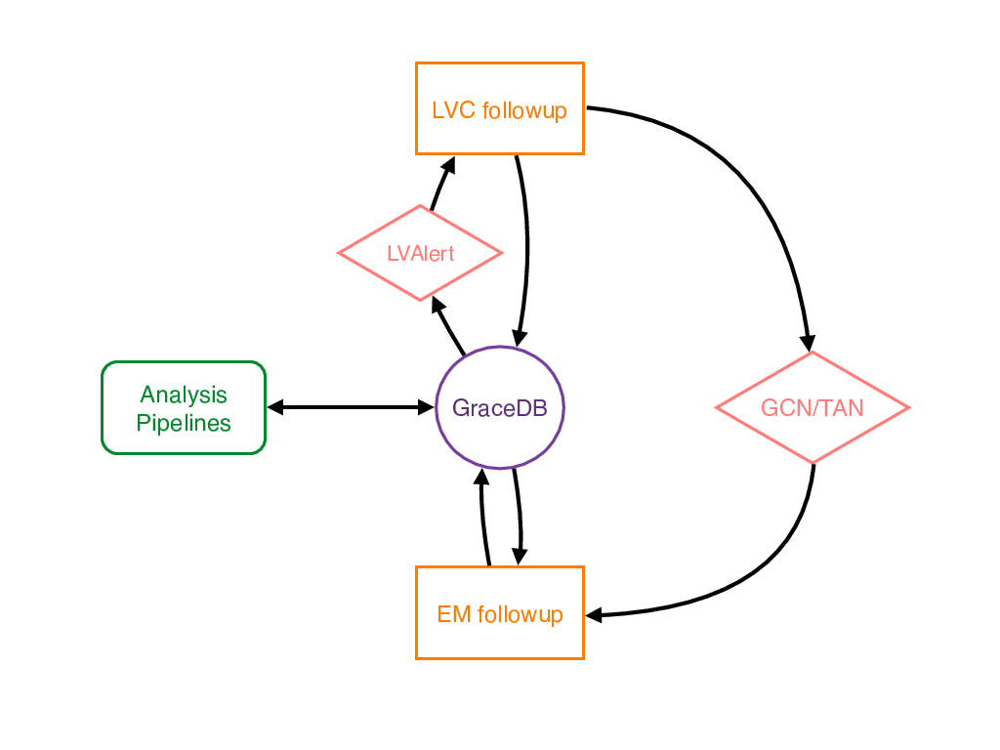

================
Introduction
================

GraceDB in context
==========================

GraceDB serves as a communications hub and as a database for storing and displaying
information about candidate gravitational-wave events and related electromagnetic events:

The primary responsibilities of GraceDB are to:

- ingest and store information about events
- expose that information to users and followup robots
- send alerts about each new piece of information

As such, GraceDB curates content from many sources, but does not itself produce
any original scientific content.  The service is mainly geared toward low latency
data analysis
and electromagnetic followup, but need not be used exclusively for those
purposes. The diagram above depicts a typical sequence of events:

#. An LVC data analysis pipeline detects an interesting candidate
   gravitational wave (GW) event and submits it to GraceDB.
#. GraceDB sends an LVAlert message which notifies LVC followup 
   robots of the new event.
#. The followup robots perform analyses and report results back to
   GraceDB. These results accumulate on the candidate event's page.
#. Eventually, a designated EM approval robot  
   forwards the event to `GCN/TAN <http://gcn.gsfc.nasa.gov>`__.
#. Astronomers receive a GCN Notice for the new event, perform followup
   observations, and report coordinates via GraceDB.

Overview of components
======================

GraceDB consists of the server (`gracedb.ligo.org <https://gracedb.ligo.org>`__) 
and a set of client tools. Two user interfaces are available: the web interface
for browser access (i.e., the one you are using now), and the 
`REST <https://en.wikipedia.org/wiki/Representational_state_transfer>`__ API.
These interfaces represent the information in GraceDB in different ways:
the web interface naturally represents information as HTML pages, whereas
the REST interface delivers JSON-serialized data.

The client tools (available via ``pip``, SL6 or Debian packages, and source
build, see :ref:`installing_the_client`) provide a way to interact via the REST API. 
These tools include a Python client class
with methods for all common GraceDB operations. 
There is also a ``gracedb`` executable for the command line with much of 
the same functionality.

The GraceDB API conforms to the RESTful principles of "uniform interface" and
"resource-oriented architecture".

Where can I go for help?
==================================

This documentation is not as great as it could be, but
we are working on it. For help with issues not addressed here, please
send mail to uwm-help@ligo.org.

